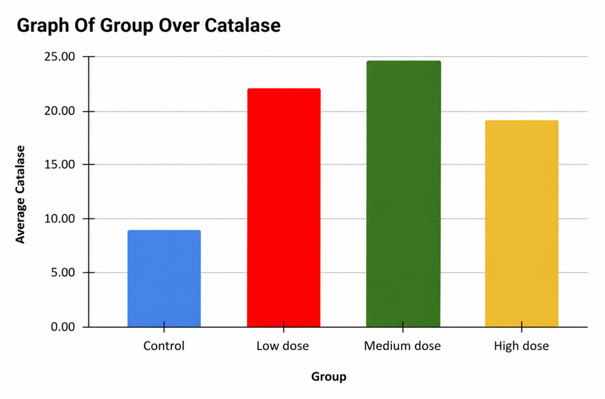
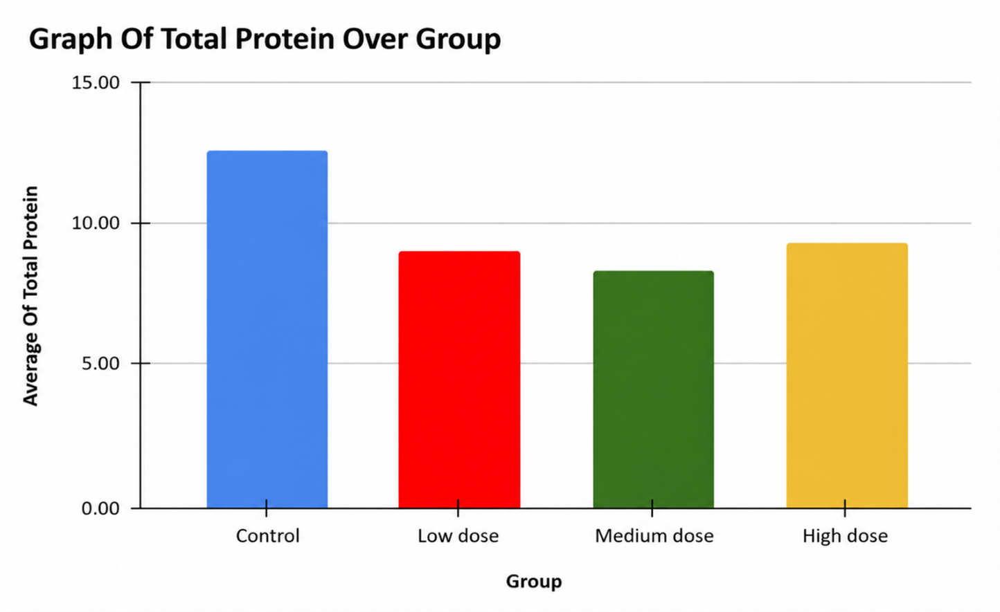
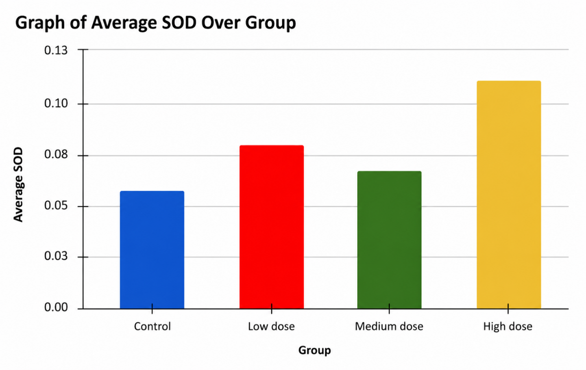
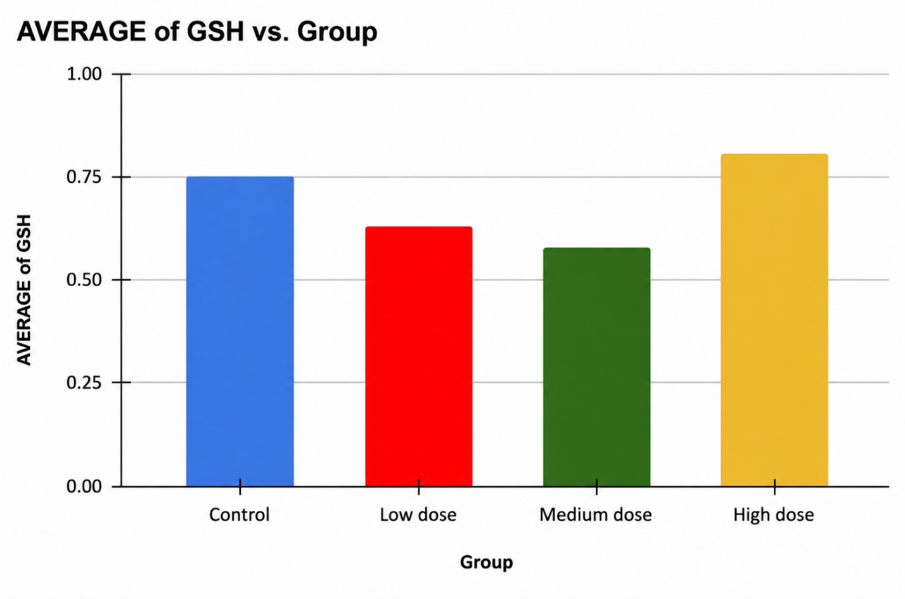
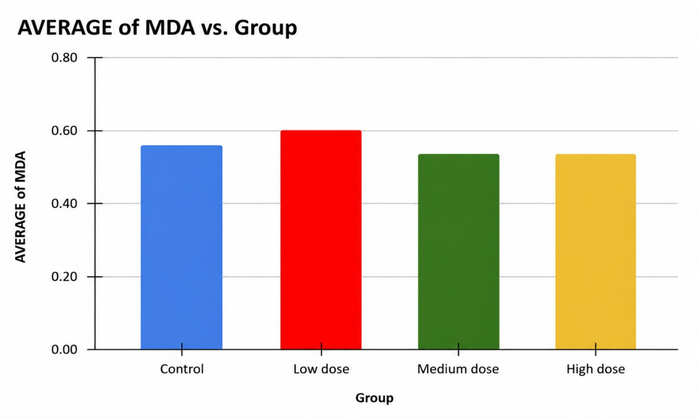
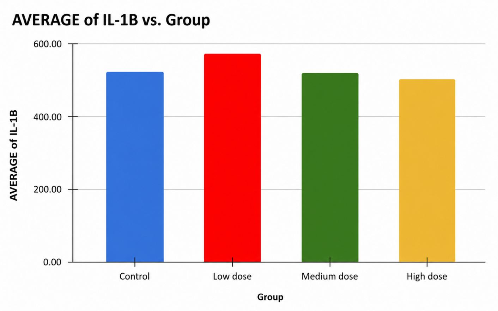

Oxidative Stress Biomarker Analysis

Project Overview
This project evaluates oxidative stress biomarkers across experimental groups to assess biological responses to exposure. The analysis focuses on identifying trends in oxidative damage, inflammation, and antioxidant activity.

Objectives
- Compare biomarker levels across Control, Low dose, Medium dose, and High dose groups
- Identify patterns of oxidative stress and inflammatory response
- Evaluate changes in antioxidant defense mechanisms

Tools Used
- Excel – Data cleaning and preprocessing  
- SPSS / Jamovi – Statistical analysis (ANOVA, Kruskal-Wallis)  
- Data Visualization – Graphical representation of biomarker trends  

Methodology
1. Grouping of subjects into experimental categories  
2. Calculation of mean and standard deviation  
3. Normality testing  
4. One-way ANOVA / Kruskal-Wallis analysis  
5. Visualization of biomarker trends  
6. Interpretation of biological significance  

Key Findings
- MDA levels showed variation across groups, suggesting lipid peroxidation and oxidative damage.
- IL-1β levels indicated inflammatory responses associated with exposure.
- Antioxidant biomarkers (SOD, Catalase, GSH) demonstrated adaptive physiological responses.
- The control group remained relatively stable across all measured biomarkers.

Visualizations

Catalase activity showed variation across experimental groups, suggesting changes in antioxidant defense mechanisms in response to exposure.

Total protein levels varied slightly across groups, indicating possible physiological adaptation to experimental conditions.

SOD levels showed group-based differences, reflecting the body’s response to oxidative stress.

GSH levels demonstrated fluctuations across groups, indicating changes in cellular antioxidant capacity.

MDA levels varied across experimental groups, suggesting differences in lipid peroxidation and oxidative damage.

IL-1β levels indicated inflammatory response patterns across groups, with variation linked to exposure levels.

Full Report

For a detailed statistical analysis and full methodology, see the complete report:

[View Full Analysis](glyphosate_analysis_report.pdf.pdf)

Relevance

Understanding oxidative biomarkers is critical in assessing tissue damage, inflammation, and disease progression in biomedical research.

Conclusion

This project demonstrates the application of statistical analysis and data visualization to biomedical research data, providing insights into oxidative stress and physiological response patterns across experimental groups.
